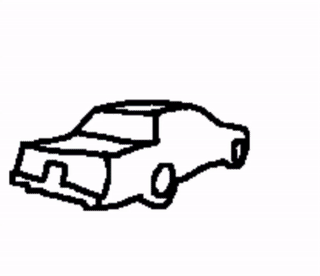

# Sketch2Mesh: Reconstructing and Editing 3D Shapes from Sketches

 

This is the PyTorch implementation of the ICCV 2021 paper [Sketch2Mesh](https://arxiv.org/abs/2104.00482). We provide pre-trained networks and code for demonstrating our global differentiable refinement procedure of 3D shapes from 2D sketches.

The below instructions describe how to:
1. [setup the python environment](#setup-environment)
2. [download data](#Download-the-test-set)
3. [download pre-trained networks](#Download-pre-trained-networks)
4. [launch refinement](#Launch-reconstruction-and-optimization)
5. [read metrics](#Parallelization)

## Setup environment
Set up a conda environment with the right packages using:
```
conda env create -f conda_env.yml
conda activate sketch2mesh
```

## Download the test set

We provide our test set in the form of an archive containing
[sketches](https://drive.google.com/file/d/1Zwp5MdvHY13zjF5KndueBpSBsqW_9Ip1/view?usp=sharing) (~8MB) and the associated 
[meshes](https://drive.google.com/file/d/1iAr12e3cqribB7jDGogLToxtzRNZP82M/view?usp=sharing) (~530MB). The latter is a subset of [ShapeNet](https://shapenet.org/) meshes that were pre-processed by [DISN](https://github.com/laughtervv/DISN) authors.

To download both sketches and meshes directly at the right location using [gdown](https://github.com/wkentaro/gdown) (already installed if you followed the above setup with conda), from the root folder of the cloned repo use:

```
cd dataset
gdown https://drive.google.com/uc?id=1Zwp5MdvHY13zjF5KndueBpSBsqW_9Ip1
gdown https://drive.google.com/uc?id=1iAr12e3cqribB7jDGogLToxtzRNZP82M
unzip Sketches.zip
unzip Meshes.zip
rm Sketches.zip
rm Meshes.zip
cd ..
```

## Download pre-trained networks
Pre-trained encoder-decoder networks for sketches of [cars](https://drive.google.com/file/d/1C09_0RMiG2on8rvEqo3z79GzDoGvI3I2/view?usp=sharing) and [chairs](https://drive.google.com/file/d/1MEf4p-MaSVzL9v3i1GTMzJogM_0ciz6y/view?usp=sharing) (~35MB each) should be downloaded to the `output` directory using:
```
mkdir output
cd output
gdown https://drive.google.com/uc?id=1C09_0RMiG2on8rvEqo3z79GzDoGvI3I2
gdown https://drive.google.com/uc?id=1MEf4p-MaSVzL9v3i1GTMzJogM_0ciz6y
unzip cars.zip
unzip chairs.zip
rm cars.zip
rm chairs.zip
cd ..
```

These networks were trained on the Suggestive sketching style (see main paper).

## Launch reconstruction and optimization

Reconstruction and refinement from a collection of input sketches is done in `reconstruct_sketch2mesh.py`, with the following options:

* `--experiment` : relative path to either the chairs (`output/chairs`) or cars (`output/cars`) pre-trained network directory,
* `--out_dir` : output sub-directory where optimized meshes will be stored,
* `--sketch_style` : style of the input sketches, from `[fd | suggestive | handdrawn (for cars only)]`. See the main paper (Sec. 4.1) for more explanations.

For example, to launch reconstruction + refinement on hand drawn cars:
```
python reconstruct_sketch2mesh.py --experiment output/cars --out_dir sugg_to_hand --sketch_style handdrawn
```

### Parallelization

We provide a very simplistic parallelized implementation, using additional options `--n` and `--N`. The list of test shapes is divided into `N` equal chunks, and the `n`-th launched process handles the `n`-th chunk. For example, launching 6 reconstruction threads in parallel for the above reconstruction is done with

```
(python reconstruct_sketch2mesh.py --experiment output/cars --out_dir sugg_to_hand --sketch_style handdrawn --N 6 --n 1 &
python reconstruct_sketch2mesh.py --experiment output/cars --out_dir sugg_to_hand --sketch_style handdrawn --N 6 --n 2 &
python reconstruct_sketch2mesh.py --experiment output/cars --out_dir sugg_to_hand --sketch_style handdrawn --N 6 --n 3 &
python reconstruct_sketch2mesh.py --experiment output/cars --out_dir sugg_to_hand --sketch_style handdrawn --N 6 --n 4 &
python reconstruct_sketch2mesh.py --experiment output/cars --out_dir sugg_to_hand --sketch_style handdrawn --N 6 --n 5 &
python reconstruct_sketch2mesh.py --experiment output/cars --out_dir sugg_to_hand --sketch_style handdrawn --N 6 --n 6)
```

## Read metrics
Once the above has been performed, provide `read_metrics.py` with the path to reconstructed shapes to get 3D metrics before/after refinement. For example:
```
python read_metrics.py -d output/cars/Optimizations/latest/sugg_to_hand/ShapeNetV2/02958343/
> Across 113 shapes:
>  - Average initial 3D Chamfer: 6.835395413599249
>  - After refinement: 3.7756478764215666
```

